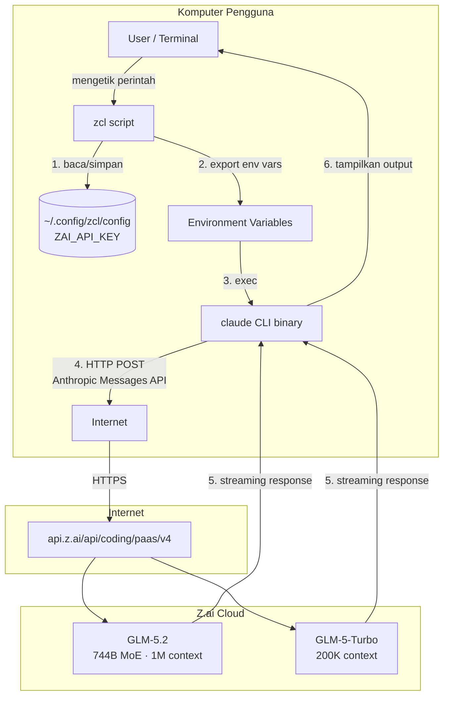
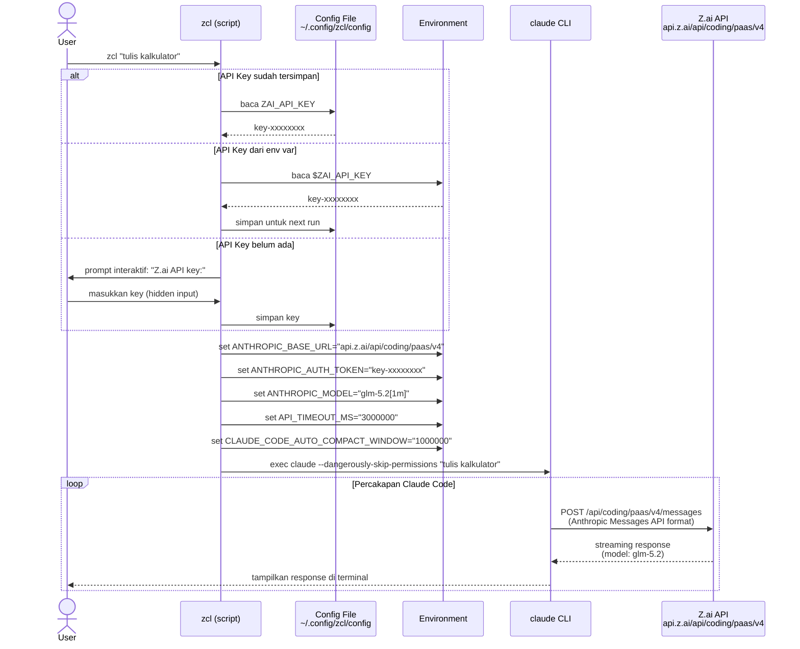
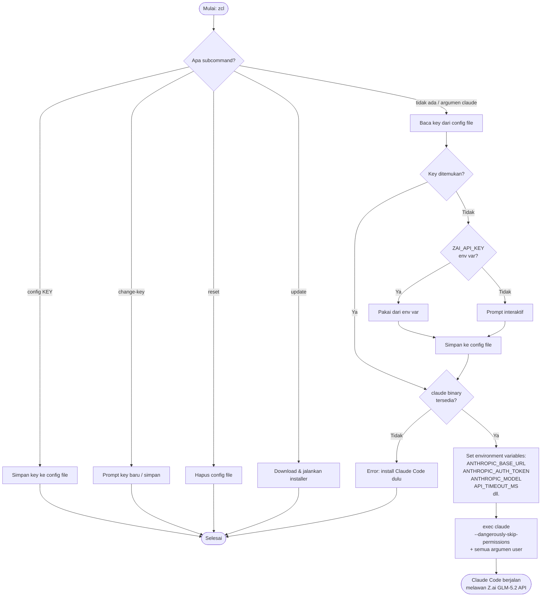
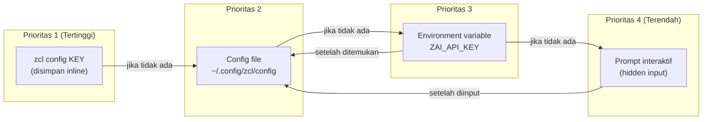
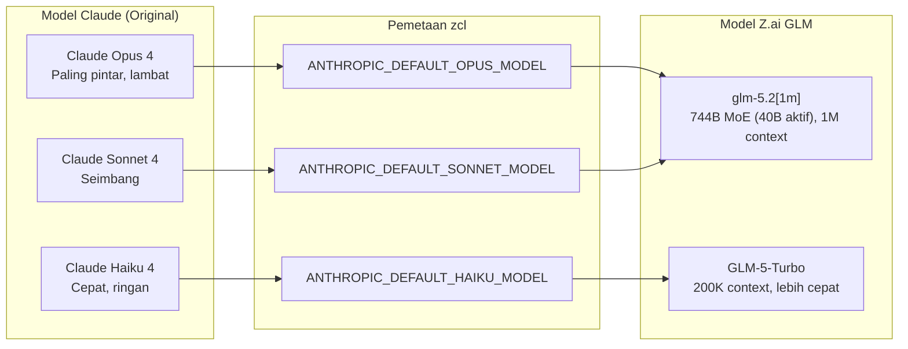
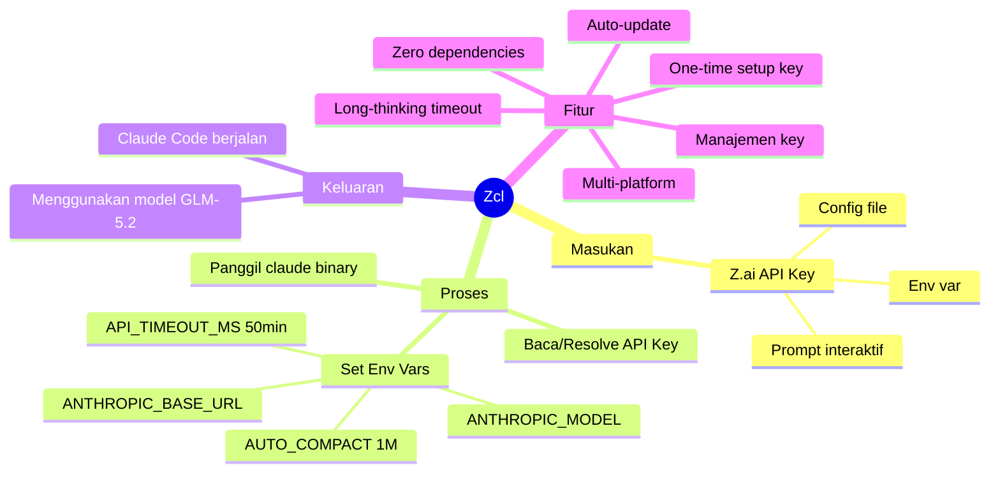

# 🔀 Zcl

> Jalankan [Claude Code](https://docs.claude.com/en/docs/claude-code) menggunakan
> [Z.ai GLM-5.2](https://z.ai) API yang kompatibel dengan protokol Anthropic.

---

## 📖 Daftar Isi

- [Bagaimana Cara Kerjanya?](#-bagaimana-cara-kerjanya)
- [Arsitektur Sistem](#-arsitektur-sistem)
- [Diagram Alir (Flowchart)](#-diagram-alir-flowchart)
- [Alur Resolusi API Key](#-alur-resolusi-api-key)
- [Flags & Subcommands Lengkap](#-flags--subcommands-lengkap)
- [Environment Variables](#-environment-variables)
- [Kustomisasi Model](#-kustomisasi-model)
- [Safe Mode](#-safe-mode)
- [Instalasi](#-instalasi)
- [Penggunaan](#-penggunaan)
- [Manajemen Kunci API](#-manajemen-kunci-api)
- [Update & Uninstall](#-update--uninstall)
- [Keamanan](#-keamanan)
- [Development](#-development)

---

## 🧠 Bagaimana Cara Kerjanya?

### Konsep Inti

Claude Code adalah CLI resmi dari Anthropic yang secara default berkomunikasi dengan
API Anthropic (`https://api.anthropic.com`). Namun, Claude Code mendukung
**penggantian base URL** melalui environment variable `ANTHROPIC_BASE_URL`.

Z.ai menyediakan endpoint yang **kompatibel dengan protokol Anthropic** di:

```
https://api.z.ai/api/coding/paas/v4
```

Artinya, Z.ai "berpura-pura" menjadi server Anthropic — menerima request
berformat Anthropic Messages API, memprosesnya dengan model GLM-5.2, dan
mengembalikan response dalam format yang sama persis seperti yang diharapkan
Claude Code.

**Zcl** adalah **wrapper script** yang menjembatani keduanya dengan cara:

1. 🔑 **Mengambil** Z.ai API key (dari config file, env var, atau prompt interaktif)
2. 🌐 **Mengeset** `ANTHROPIC_BASE_URL` ke endpoint Z.ai
3. 🎯 **Memetakan** model Claude (Opus/Sonnet/Haiku) ke model GLM yang sesuai
4. ⏱️ **Mengeset** timeout 50 menit untuk long-thinking tasks GLM-5.2
5. 🚀 **Menjalankan** binary `claude` dengan environment yang sudah dikonfigurasi

```
┌─────────────┐     Environment Variables      ┌──────────────────────┐
│             │────────────────────────────────▶│                      │
│  zcl        │  ANTHROPIC_BASE_URL             │  claude CLI binary   │
│  (wrapper)  │  ANTHROPIC_AUTH_TOKEN           │  (dari Anthropic)    │
│             │  ANTHROPIC_MODEL                │                      │
└─────────────┘  API_TIMEOUT_MS                 └──────────┬───────────┘
                 CLAUDE_CODE_AUTO_COMPACT_WINDOW           │
                                                    HTTP Request
                                                    (Anthropic Protocol)
                                                           │
                                                           ▼
                                              ┌────────────────────────┐
                                              │  api.z.ai              │
                                              │  /api/coding/paas/v4   │
                                              │                        │
                                              │  Model: glm-5.2[1m]    │
                                              │  Model: GLM-5-Turbo    │
                                              └────────────────────────┘
```

### Mengapa Ini Bekerja?

| Komponen | Peran |
|----------|-------|
| **Claude Code CLI** | Binary resmi Anthropic — mengirim request ke API, mengelola tool calls, menampilkan UI terminal |
| **Z.ai API** | Menyediakan endpoint `/api/coding/paas/v4` yang menerima dan merespon dalam format Anthropic Messages API |
| **Zcl Script** | Shell script tipis yang menyetel env vars sebelum menjalankan `claude` |

Claude Code **tidak tahu** bahwa ia sedang berbicara dengan Z.ai, bukan
Anthropic. Dari sudut pandang Claude Code, ia hanya melihat base URL yang
berbeda — protokolnya tetap sama.

---

## 🏗 Arsitektur Sistem

### Diagram Komponen



### Diagram Sequence



---

## 🔄 Diagram Alir (Flowchart)

### Alur Utama Script



---

## 🔑 Alur Resolusi API Key

Prioritas pencarian API key (berurutan):



| Prioritas | Sumber | Keterangan |
|-----------|--------|------------|
| 1 | `zcl config <KEY>` | Diset langsung via CLI, tanpa prompt |
| 2 | `~/.config/zcl/config` | Key yang disimpan dari run sebelumnya |
| 3 | `$ZAI_API_KEY` | Environment variable — lalu disimpan otomatis |
| 4 | Prompt interaktif | Ditanyakan jika semua sumber di atas kosong |

---

## 🌍 Environment Variables

### Semua variabel yang di-set oleh Zcl

| Variable | Nilai Default | Fungsi |
|----------|--------------|--------|
| `ANTHROPIC_BASE_URL` | `https://api.z.ai/api/coding/paas/v4` | Mengarahkan Claude Code ke endpoint Z.ai |
| `ANTHROPIC_AUTH_TOKEN` | `<Z.ai API key>` | Otentikasi ke Z.ai API |
| `ANTHROPIC_MODEL` | `glm-5.2[1m]` | Model default |
| `ANTHROPIC_DEFAULT_OPUS_MODEL` | *(sama dengan MODEL)* | Pengganti Claude Opus 4 |
| `ANTHROPIC_DEFAULT_SONNET_MODEL` | *(sama dengan MODEL)* | Pengganti Claude Sonnet 4 |
| `ANTHROPIC_DEFAULT_HAIKU_MODEL` | `GLM-5-Turbo` | Pengganti Claude Haiku (lebih cepat & ringan) |
| `CLAUDE_CODE_SUBAGENT_MODEL` | `GLM-5-Turbo` | Model untuk sub-agent (task ringan) |
| `CLAUDE_CODE_EFFORT_LEVEL` | `max` | Effort reasoning maksimum |
| `API_TIMEOUT_MS` | `3000000` | Timeout 50 menit — diperlukan untuk long-thinking GLM-5.2 |
| `CLAUDE_CODE_AUTO_COMPACT_WINDOW` | `1000000` | Window auto-compact 1M — cocok dengan context GLM-5.2 |

> ⚠️ `API_TIMEOUT_MS=3000000` (50 menit) direkomendasikan oleh Z.ai untuk
> menghindari request yang terputus saat GLM-5.2 melakukan long-thinking pada
> task coding yang kompleks.

### Pemetaan Model Claude → GLM



> **Catatan:** GLM-5.2 tidak memiliki varian "flash" resmi. Untuk role Haiku dan
> sub-agent, `GLM-5-Turbo` digunakan sebagai alternatif yang lebih cepat namun
> tetap dalam keluarga model GLM-5.x.

### Variabel yang dibaca oleh Zcl (bisa di-set user)

| Variable | Fungsi |
|----------|--------|
| `ZAI_API_KEY` | API key Z.ai (auto-disimpan saat pertama digunakan) |
| `ZCL_MODEL` | Override model default |
| `ZCL_HAIKU_MODEL` | Override model Haiku/Turbo |
| `ZCL_SUBAGENT_MODEL` | Override model sub-agent |
| `ZCL_EFFORT` | Override effort level (`high` atau `max`) |
| `ZCL_TIMEOUT_MS` | Override API timeout (default: 3000000) |
| `ZCL_AUTO_COMPACT` | Override auto-compact window (default: 1000000) |
| `ZCL_SAFE=1` | Sama dengan flag `--safe` |
| `ZCL_VERBOSE=1` | Sama dengan flag `--verbose` |

---

## 🎮 Flags & Subcommands Lengkap

### Flags (zcl sendiri)

| Flag | Deskripsi |
|------|-----------|
| `--help`, `help`, `-h` | Tampilkan bantuan zcl |
| `--version` | Tampilkan versi zcl |
| `--dry-run` | Cetak apa yang akan dieksekusi, tanpa menjalankan Claude Code |
| `--verbose` | Aktifkan mode debug (setara dengan `ZCL_VERBOSE=1`) |
| `--safe` | Jalankan **tanpa** `--dangerously-skip-permissions` |
| `--` | Semua argumen setelah `--` diteruskan langsung ke `claude` |

### Subcommands

| Subcommand | Deskripsi |
|------------|-----------|
| `config [KEY]` | Simpan/ganti API key (inline atau prompt) |
| `change-key [KEY]` | Alias untuk `config` |
| `reset` | Hapus API key yang tersimpan |
| `update` | Update ke versi terbaru |
| `verify` | Verifikasi API key terhadap Z.ai API |
| `show-config` | Tampilkan konfigurasi saat ini (key dimasking) |

### Contoh Penggunaan Flags

```bash
zcl --help                          # Lihat bantuan zcl
zcl --version                       # Lihat versi
zcl --dry-run                       # Preview tanpa eksekusi
zcl --dry-run --verbose             # Preview dengan info debug
zcl --safe "hapus file lama"        # Jalankan dengan permission prompt
zcl -- --help                       # Teruskan --help ke claude (bukan zcl)
zcl --safe --verbose "prompt"       # Gabungkan beberapa flag
```

---

## 🎨 Kustomisasi Model

Kamu bisa mengganti model GLM yang digunakan melalui **config file** atau
**environment variable**. Konfigurasi di-resolve dengan prioritas:

```
Environment Variable > Config File > Default Bawaan
```

### Via Config File

Edit `~/.config/zcl/config`:

```ini
ZAI_API_KEY=your-id.your-secret
ZCL_MODEL=glm-5.2[1m]
ZCL_HAIKU_MODEL=GLM-5-Turbo
ZCL_SUBAGENT_MODEL=GLM-5-Turbo
ZCL_EFFORT=max
ZCL_TIMEOUT_MS=3000000
ZCL_AUTO_COMPACT=1000000
ZCL_SAFE=0
```

### Via Environment Variable (per-sesi)

```bash
# Override model utama untuk satu sesi
ZCL_MODEL="glm-5.2" zcl "tulis kode"

# Override beberapa sekaligus
ZCL_HAIKU_MODEL="GLM-4.7-FlashX" \
ZCL_EFFORT="high" \
zcl --safe "review dokumentasi"
```

### Model Z.ai yang Tersedia (untuk Coding)

| Model ID | Karakteristik | Context |
|----------|--------------|---------|
| `glm-5.2[1m]` | **Flagship**, reasoning terkuat, 1M context | 1M |
| `glm-5.2` | Sama, tanpa suffix 1M | 1M |
| `GLM-5-Turbo` | Varian cepat GLM-5, cocok untuk sub-agent | 200K |
| `GLM-5.1` | Generasi sebelumnya, 200K context | 200K |
| `GLM-4.7-FlashX` | Sangat murah (30B), alternatif hemat | 200K |
| `GLM-4.7-Flash` | **Gratis** (30B), untuk task sangat ringan | 200K |

> ⚠️ GLM-5.2 **tidak memiliki varian "flash" resmi**. Untuk task ringan, gunakan
> `GLM-5-Turbo` (direkomendasikan) atau `GLM-4.7-FlashX` (lebih murah).
>
> Cek [z.ai/model-api](https://z.ai/model-api) dan [docs.z.ai](https://docs.z.ai/guides/overview/pricing)
> untuk model terbaru.

---

## 🛡️ Safe Mode

Secara default, Zcl menjalankan Claude Code dengan flag
`--dangerously-skip-permissions` — artinya tool call berjalan **tanpa konfirmasi**.
Ini nyaman tapi berisiko di direktori yang tidak kamu percayai.

**Safe Mode** menonaktifkan flag tersebut, sehingga setiap tindakan (shell command,
file edit) akan meminta persetujuanmu terlebih dahulu.

### Cara mengaktifkan

```bash
# Opsi 1: Flag --safe
zcl --safe "hapus semua file cache"

# Opsi 2: Environment variable
ZCL_SAFE=1 zcl

# Opsi 3: Config file (permanen)
echo "ZCL_SAFE=1" >> ~/.config/zcl/config
```

### Kapan menggunakan Safe Mode?

| Situasi | Rekomendasi |
|---------|-------------|
| Direktori project sendiri | Non-safe (default) |
| Direktori tidak dikenal | **Safe Mode** |
| Operasi destruktif (rm, drop table) | **Safe Mode** |
| CI/CD pipeline | Non-safe (pakai env var) |
| Pertama kali mencoba zcl | **Safe Mode** |

---

## 📦 Instalasi

> **Prasyarat:** [Claude Code CLI](https://docs.claude.com/en/docs/claude-code)
> harus sudah terinstal.

### macOS / Linux

```bash
curl -fsSL https://raw.githubusercontent.com/Muhira007/z-ai-claude/main/install.sh | bash
```

Menginstal script `zcl` ke `~/.local/bin`. Jika direktori tersebut belum
ada di `PATH`, installer akan memberi tahu baris yang perlu ditambahkan ke
`~/.bashrc` atau `~/.zshrc`.

### Windows (PowerShell)

```powershell
irm https://raw.githubusercontent.com/Muhira007/z-ai-claude/main/install.ps1 | iex
```

> Di Windows kamu juga bisa menggunakan command macOS/Linux di atas dari
> **Git Bash** atau **WSL**.

---

## 🚀 Penggunaan

Jalankan pertama kali — akan diminta Z.ai API key (input tersembunyi):

```bash
zcl
```

Setelah itu, semua argumen diteruskan langsung ke `claude`:

```bash
zcl "jelaskan cara kerja Docker Compose"
zcl --help
zcl "refactor module auth menjadi lebih clean"
```

### Cara mendapatkan Z.ai API Key

1. Buka [Z.ai Model API](https://z.ai/model-api) untuk **GLM Coding Plan**
2. Atau buka [open.bigmodel.cn/usercenter/apikeys](https://open.bigmodel.cn/usercenter/apikeys)
3. Login atau daftar akun Zhipu AI / Z.ai
4. Buat API key baru
5. Masukkan saat prompt `zcl` pertama kali

> 💡 **GLM Coding Plan** memberikan akses ke endpoint coding khusus dengan
> performa optimal untuk Claude Code dan tools serupa.

---

## 🔧 Manajemen Kunci API

```bash
zcl change-key        # ganti kunci tersimpan (prompt interaktif)
zcl change-key KEY    # ganti kunci langsung tanpa prompt
zcl reset             # hapus kunci tersimpan
```

Alias yang diterima: `config`, `set-key`, `change` — semuanya sama dengan `change-key`.

### Lokasi Penyimpanan Key

| Platform      | Path                                     | Permission        |
|---------------|------------------------------------------|-------------------|
| macOS / Linux | `~/.config/zcl/config`                   | `600` (owner only)|
| Windows       | `%APPDATA%\zcl\config`                   | ACL: user only    |

> ⚠️ Key disimpan dalam **plaintext** di mesin lokal. Siapa pun dengan akses ke
> akun user kamu bisa membacanya. Perlakukan seperti kredensial lokal lainnya.

---

## 🔄 Update & Uninstall

### Update ke versi terbaru

```bash
zcl update
```

### Uninstall

**macOS / Linux:**

```bash
rm ~/.local/bin/zcl
rm -rf ~/.config/zcl
```

**Windows (PowerShell):**

```powershell
Remove-Item -Recurse -Force "$env:LOCALAPPDATA\Programs\zcl"
Remove-Item -Recurse -Force "$env:APPDATA\zcl"
```

---

## 🔐 Keamanan

- `--dangerously-skip-permissions` digunakan agar Claude Code berjalan tanpa
  prompt persetujuan per tindakan. **Nyaman, tapi berisiko** — artinya perintah
  shell dan edit file berjalan tanpa konfirmasi. Gunakan di direktori yang
  kamu percayai.
- API key disimpan di local filesystem dengan permission ketat (`chmod 600`).
- Tidak ada data yang dikirim ke server selain ke Z.ai API.
- Semua komunikasi menggunakan HTTPS.

---

## 🧩 Ringkasan Visual



---

---

## 👩‍💻 Development

### Struktur Proyek

```
zcl/
├── zcl                     # Script Bash utama (Linux/macOS)
├── zcl.ps1                 # Script PowerShell (Windows)
├── install.sh              # Installer Bash
├── install.ps1             # Installer PowerShell (Windows)
├── completions/            # Shell completions (bash/zsh/fish)
├── tests/                  # BATS test suite
├── .github/workflows/      # CI/CD pipeline
├── Makefile                # Perintah development
├── CONTRIBUTING.md         # Panduan kontribusi
└── README.md               # Dokumentasi
```

### Development Commands

```bash
make check      # Jalankan linting + test
make lint       # ShellCheck saja
make test       # BATS test saja
make install    # Install ke ~/.local/bin (local dev)
make bump       # Bump versi di semua script
make completions # Generate shell completions
```

### CI/CD

GitHub Actions otomatis berjalan untuk setiap push ke `main`:

| Job | Deskripsi |
|-----|-----------|
| **ShellCheck** | Static analysis untuk Bash script |
| **PSScriptAnalyzer** | Static analysis untuk PowerShell |
| **BATS Tests** | Unit & integration test |
| **Smoke Test** | `--help`, `--version`, `--dry-run` |

### Kontribusi

Lihat [CONTRIBUTING.md](CONTRIBUTING.md) untuk panduan lengkap.

---

## ❓ FAQ

### Kenapa tidak ada model "flash" untuk GLM-5.2?

GLM-5.2 adalah model flagship Z.ai (744B MoE, 40B aktif per token). Z.ai belum
merilis varian "flash" untuk generasi 5.2. Untuk task ringan, `GLM-5-Turbo`
digunakan sebagai alternatif.

### Apa beda endpoint `/api/anthropic` vs `/api/coding/paas/v4`?

| Endpoint | Kegunaan |
|----------|----------|
| `/api/anthropic` | General Anthropic Messages API — untuk semua tools |
| `/api/coding/paas/v4` | **Coding Plan** khusus — dioptimalkan untuk Claude Code, Cline, dll |

Zcl menggunakan `/api/coding/paas/v4` karena dioptimalkan untuk coding.

### Kenapa timeout diset ke 50 menit?

GLM-5.2 melakukan long-thinking untuk task coding kompleks. Timeout default
Claude Code mungkin terlalu pendek. `API_TIMEOUT_MS=3000000` adalah rekomendasi
resmi dari Z.ai.

---

## 📄 Lisensi

MIT — lihat [LICENSE](LICENSE).

---

> Dibuat dengan ❤️ oleh [Muhira007](https://github.com/Muhira007) |
> Dokumentasi diperkaya dengan diagram oleh [Claude Code](https://claude.com/claude-code) |
> Didukung oleh endpoint Anthropic-compatible [Z.ai](https://z.ai) untuk GLM-5.2
